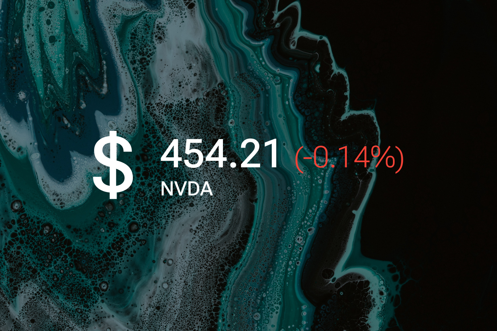

# Stonk

A simple stock market widget for Rainmeter. It shows you the currency, current market value and the relative rise/fall of the stock compared to the previous close of your favorite stock. You can also hold your cursor on the text to reveal more information.

As always, right-click and hit "Settings..." to change the settings.

----

## Installation

1. Download and install the latest version of [Rainmeter](https://www.rainmeter.net/).  
2. Download the [skin](https://github.com/adriaanjelle/Stonk/releases/latest) and open the .rmskin file (it should have a green raindrop icon).  
3. Done!
